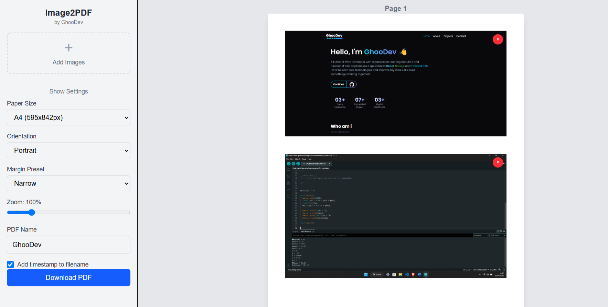

# Image-to-PDF Converter



A professional drag-and-drop tool to convert images to PDF with customizable layouts.

## Features

- Drag-and-drop image reorganization
- Customizable page sizes (A4, Letter, etc.)
- Adjustable margins and orientation
- PDF preview with real-time updates
- Responsive design for all devices

## Technologies

- Next.js 15
- React DnD
- jsPDF
- Tailwind CSS

## Getting Started

### Installation

```bash
git clone https://github.com/revxcode/Image2PDF.git
cd Image2PDF
npm install
```

### Development

```bash
npm run dev
```

### Production Build

```bash
npm run build
npm start
```

## License

MIT
